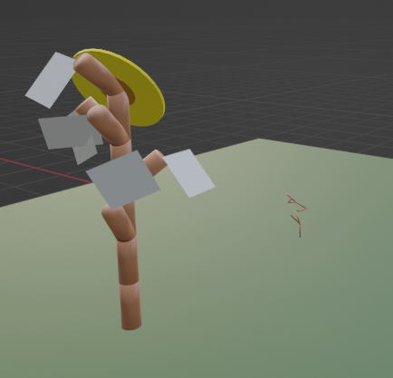

# Dissertation project

A project for undegraduate final year.

## Copyright and License

This work is licensed under a Attribution-NonCommercial-ShareAlike 4.0 International.
To view a copy of this license, visit [https://creativecommons.org/licenses/by-nc-sa/4.0/legalcode.en](https://creativecommons.org/licenses/by-nc-sa/4.0/legalcode.en)

## Table of Contents
1. [Introduction](#introduction)
2. [Installation](#installation)
3. [Prerequisites](#prerequisites)
4. [Installation Steps](#installationsteps)
5. [Usage](#usage)
6. [Troubleshooting](#troubleshooting)
7. [Example Product Images]()
8. [Contact](#contact)

## Introduction
The purpose of this project is to develop a tool for garden planning, featuring randomness and frame control for achieving plant's growth, and solving less effective method of garden planning such as drawing by hand and static application software.

## Installation

### Prerequisites
User only need to download Blender and add the python code as add-on, follow the steps below:

### Installation Steps
1. Visit https://www.blender.org/download/. Click tab 'Releases' > 'Blender 3.4' and above. (The system also works well in 2.8x)

2. Open a Blender, clear the areas that's not needed.

3. Click tab 'Edit' > 'Preferences...' > 'Install..."

4. Find the python file in directory located in the hardware. 

## Usage
### File usage
1. branching prototype.py: code specifically for growing stem only, no specific details of plant and already made rule of growth
2. garden planning.py: code able to grow specific type of plants, no realism details of plant but have distinct shape and already made rule of growth

### Control panel
1. X, Y, Z: location input for exact location of plant
2. Number of plants: Choosing number of plants to plant randomly
3. Add Plants Randomly: Operator panel that will add the plants
4. Clear scene: clearing all data and scenery in viewport
5. Plane size: the plane named 'soil' indicating garden plane for gardening
6. Plane color: allow changing plane colour
7. Add Plane: will take the values and create plane into scene
8. Add camera: add camera for rendering purposes
9. Start/End week: length of simulation in frame term
10. Grow scene: Start/stop growing plant in the scene directly
11. Grow and render scene: Start rendering of growing plant in 'image editor'
12. Reset: clear grew stems and branches, maintain initial location 
13. Plant type: Contain name of the plants, with ready made rules and shape using this dictionary value

## Troubleshooting
### Initial bug
1. When first use of the Blender file and add-on, the collection will have 'Collection' in 'Scene Collection'.
2. Delete the 'Collection' collection, or Click 'Clear Scene' before start.
3. There should be only 'Scene Collection'

### Rendering
1. Rendering still have bugs with Sunflower, thus it does not work well.
2. If use on branching prototype.py, low frame size will work but higher frame size will causes shutdown of the Blender

## Example Product Images

Below are some example images representing different aspects of the system:

| Image | Description |
|-------|-------------|
|  | *Side view of the product showcasing the overall structure and design.* |
|  | *Close-up view highlighting the detailed features and texture of the product.* |
|  | *An illustration of the branching process in the system, showing multiple growth iterations.* |
|  | *Visualization of the growth rules applied to the system, demonstrating how elements develop.* |
|  | *Another view of the growth rule, illustrating different patterns and behaviors in the system.* |
|  | *A detailed view of the growth rule application, showing the progression of element expansion.* |

## Contact
Contact details:
- **Email**: zuhairanasrin.zakaria@gmail.com

